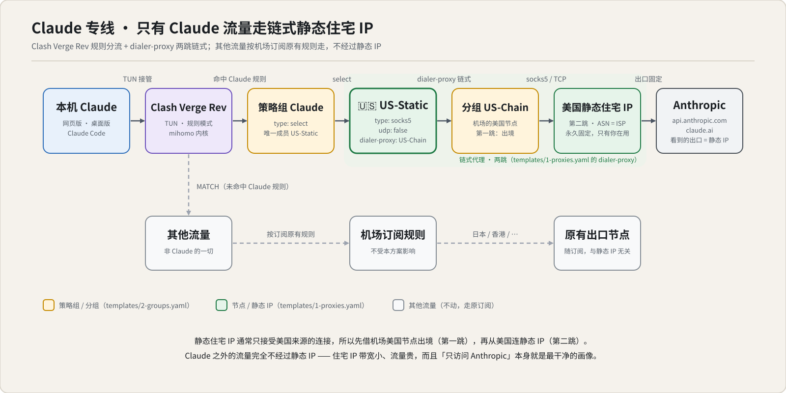
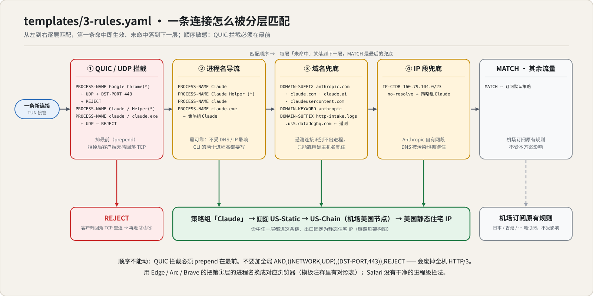
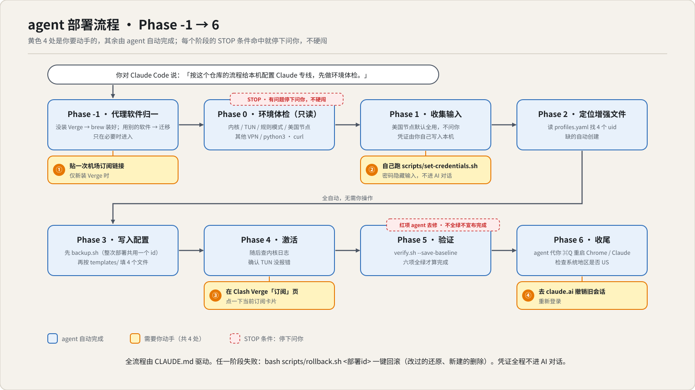

# Claude 专线：让 Claude 流量走美国静态住宅 IP（agent 一键复刻版）

仅支持 macOS · 版本以根目录 [`VERSION`](VERSION) 为准 · 更新日志见 [CHANGELOG.md](CHANGELOG.md)

让 macOS 上的 Claude（网页版 / 桌面版 / Claude Code 全覆盖）永久走一个**固定的美国静态住宅 IP**，其余流量保持机场订阅原有规则不变。配置不用你手改文件——由你自己的 Claude Code agent 照本仓库执行。

## 先说结论

- **效果**：Anthropic 看到的出口 IP = 你的静态住宅 IP，永久固定；其他网站的线路和速度不受影响。
- **代价**：一份美国静态住宅 IP（约 $4–6/月，最低档就够）+ 你已有的机场订阅（套餐里必须有美国节点）。
- **你要动手的只有 4 件事**：（新装 Verge 时）贴一次订阅链接 → 自己跑一次 `scripts/set-credentials.sh` → 在 Clash Verge「订阅」页点一下订阅卡片 → 去 claude.ai 撤销旧会话重登。其余全由 agent 完成，凭证不进对话。
- **实际使用情况**：作者已稳定使用约一年，跨两台 Mac、一台 Windows、一台 iPhone，期间账号零异常封禁。仓库 2026-04 才整理成文，git 历史比实际使用时间短；排障手册里的 12 个坑全部来自真实故障。



## 为什么（3 分钟版，知其所以然再动手）

**为什么要固定 IP？** 机场节点是共享出口，IP 经常换、还和无数陌生用户共用。在 Claude 看来你就是"今天日本明天美国、和一堆人共用 IP"的可疑账号。一个只有你在用、永不变化的美国住宅 IP，画像干净得多。

**为什么要"链式"？** 美国静态住宅 IP 通常只接受美国来源的连接，从国内直连会被拒/超时。所以先借机场的美国节点出境（第一跳），再从美国连静态 IP（第二跳）。这就是模板里 `dialer-proxy: "US-Chain"` 干的事。

**为什么只有 Claude 走这条线？** 住宅 IP 带宽小、流量贵，扛不住日常刷网页；而且"这个 IP 只访问 Anthropic"本身就是最干净的画像。所以用 Clash 的分流规则精确圈出 Claude 的流量——按进程名、域名、IP 段三层兜底，其余流量照旧走机场：



**QUIC 拦截是干嘛的？** Chrome 会用 UDP 的 QUIC 协议直连，绕过域名识别导致漏流（实测会漏到日本节点）。把 Chrome 的 QUIC 拒掉，它会无感回落到 TCP，就能被规则抓住了——所以图里第①层必须排最前。

## 怎么做

### 准备三样东西

1. **机场订阅**（套餐里**必须有美国节点**）。已经在用 Clash Verge Rev 最好；用别的代理软件、或者什么都没装也行——agent 会帮你装 Verge 并迁移，你只需提供订阅链接（原来的代理软件要退出卸载）
2. **美国静态住宅 IP** 一份（要求见下表，**买错了整套白搭**）
3. **Claude Code** 已安装、能正常对话。干净的 Mac（从没装过 Xcode 命令行工具）先看 `docs/troubleshooting.md` 第 11 条铺平 git / python3 依赖

| 项 | 要求 | 说明 |
|---|---|---|
| 地区 | **美国** | 别选新加坡/日本，本方案的价值就在美国出口 |
| 类型 | **静态住宅（Static Residential / ISP）** | ⚠️ **不能是动态或轮换（Rotating）IP**——每次请求换 IP 的话画像比机场还乱 |
| 协议 | **SOCKS5** | 有的服务商默认给 HTTP 凭证，要在订单里切到 SOCKS5 |
| 带宽 / 数量 | **最低档、1 个** | Claude 流量非常小；多台设备共用同一个（见 FAQ） |
| UDP | **不需要** | 模板刻意设了 `udp: false`（防 QUIC 漏流的一环） |

拿到手是一组四元组：`主机(host) / 端口(port) / 用户名(username) / 密码(password)`。具体买哪家本仓库不做推荐（理由见 [`docs/faq.md`](docs/faq.md#购买--下载渠道)），按上表要求自己挑即可。

### 快速开始

```bash
git clone https://github.com/maien210/claude-lane
cd claude-lane
claude
```

没有 git 的干净机器用 zip（`curl` / `unzip` 是 macOS 自带）：

```bash
cd ~ && curl -fL https://codeload.github.com/maien210/claude-lane/zip/refs/heads/main -o claude-lane.zip \
  && unzip -oq claude-lane.zip && mv claude-lane-main claude-lane && cd claude-lane && claude
```

然后对 Claude 说一句：

> **按这个仓库的流程给本机配置 Claude 专线，先做环境体检。**

### agent 会带你走的流程



图中黄色的 4 处是你全程要动手的事，其余由 agent 自动完成；任一阶段的 STOP 条件命中它会停下问你，不硬闯。

> 🔒 **凭证不进对话**：静态 IP 的账号密码由你自己跑 `scripts/set-credentials.sh` 写入本机（密码隐藏输入），AI 全程只看到打码后的确认信息。贴进聊天框等于发到模型服务端、并留在本机会话记录里。

不想用 agent、或想亲手做一遍搞懂每一步的：照 **`docs/manual-setup.md`**（人肉版手册，和 agent 流程完全等价，约 20–30 分钟）。

### 不是 macOS + Clash Verge？

**方案本身**（Clash 分流 + 链式静态住宅 IP）作者在 macOS、Windows、iPhone 上都长期稳定使用过；**本仓库的自动化部分**（agent 手册、`verify.sh`）是 macOS 专用：

| 平台 | 方案可用性 | 本仓库的自动化 |
|---|---|---|
| **macOS**（Apple Silicon / Intel） | ✅ 长期稳定使用 | ✅ **完整支持**：agent 全自动 + `verify.sh` 六项体检 |
| **Windows** | ✅ 作者实测跑通并稳定用过 | ❌ 手动：照 `docs/manual-setup.md` 的思路，配置目录换成 `%APPDATA%` 下同名文件夹、`Google Chrome` 换成 `chrome.exe`，规则和模板照抄；验证用 `docs/porting.md` 里那两条命令 |
| **iPhone / iOS** | ✅ 作者在用 | ❌ 手动，5 分钟：Shadowrocket 已验证配方见 [`docs/iphone-notes.md`](docs/iphone-notes.md) |
| Linux | ⚠️ 未试过 | ❌ 不支持（且 Claude 桌面版没有 Linux 版） |

不用 Clash Verge 的（Surge / sing-box 等），看 `docs/porting.md`——那里把方案抽象成了平台无关的规格（未验证，不担保）。

## 怎么验

平时什么都不用管。**唯一要记住的一个动作**：感觉不对劲（会话归属地变了、Claude 突然要验证、连不上）就跑一遍体检：

```bash
bash scripts/verify.sh
```

它会拿当前出口和**部署时实测记录的基线**比对（存在 `claude-lane-state.json`），所以能发现「出口悄悄换了」；换过静态 IP 之后用 `--save-baseline` 更新基线。配好的机器应该长这样（IP 是示例）：

```
== Claude 专线验证 ==
[1/6] 内核与 TUN          ✅ mihomo API 可达  ✅ TUN 无启动错误
[2/6] 策略组状态          ✅ Claude 组 → 🇺🇸 US-Static  ✅ US-Chain 组 → 🇺🇸 美国节点 03
[3/6] 规则完整性          ✅ QUIC 拦截在最前  ✅ 在跑的 Claude 进程都有规则  ✅ 遥测域名规则存在
[4/6] 出口双验（关键）
  ✅ claude.ai 出口 = 198.51.100.10 (US) <- 与基线一致
  ✅ 普通流量出口 = 203.0.113.55 <- 机场节点, 未误走静态
[5/6] 日志漏流扫描        ✅ 无 Claude/Anthropic 流量走到非 Claude 组
[6/6] 其他 VPN 检测       ✅ 无其他 VPN 在运行
== 六项全部通过，部署成功 ==
```

六项全绿 = 专线没问题，别处找原因（最常见是 claude.ai 里旧地区的会话没撤销，见 FAQ）；有红项 = 按提示对照 `docs/troubleshooting.md`（12 个真实踩过的坑）处理。还不行就把 `verify.sh` 的输出贴出来提 issue——**贴之前记得把静态 IP、节点名、订阅名涂掉**。

## 红线（配完必读）

1. **本机不要再装 / 开第二个代理或 VPN App**（Shadowrocket、Surge 等）——会和 Clash 抢系统路由，轻则规则失效、重则整机断网。手机版 Shadowrocket 不受影响，是 Mac 上不行。
2. Clash 保持**规则模式**，不要切"全局"或"直连"（全局模式下 Claude 专线规则全部失效）。
3. 每次改配置后：**⌘Q 完全退出并重启** Chrome 和 Claude 桌面版（QUIC/连接有缓存）。

两条提醒：出问题先跑 `scripts/verify.sh`，看哪项红了再对照排障手册；**别乱设遥测环境变量**（`DISABLE_TELEMETRY` 等）、别在网页版里多账号混用（见 `docs/account-safety.md`）——专线只保证出口 IP 干净，这些坑它管不了。静态 IP / 机场的账号密码只存在本机 Clash 配置里，**绝不要提交进 git、贴进群聊**。

## 常见问题

全部在 [`docs/faq.md`](docs/faq.md)。最常被问的几个：

- [一共要花多少钱？](docs/faq.md#一共要花多少钱)
- [多台设备能共用同一个静态 IP 吗？](docs/faq.md#多台设备能共用同一个静态-ip-吗)
- [配砸了怎么恢复？](docs/faq.md#配砸了怎么恢复)
- [都配好了，为什么 Claude 有时候还是提示异常 / 要我验证？](docs/faq.md#都配好了为什么-claude-有时候还是提示异常--要我验证)
- [不用 Clash Verge、或不用 Claude Code 而用别的 agent，行吗？](docs/faq.md#我现在用的不是-clash-vergesurge--clashx--sing-box怎么办)

## 仓库结构

| 文件 | 用途 |
|---|---|
| `CLAUDE.md` | agent 执行手册（含安装迁移的全阶段流程，Claude Code 进入本目录自动加载） |
| `templates/` | 4 个 Clash 增强文件模板（填空即用）+ `optional-payment-rules.yaml`（可选：订阅付款走静态 IP，默认不启用） |
| `scripts/verify.sh` | 一键六项验证（`--save-baseline` 记录出口基线） |
| `scripts/set-credentials.sh` | 本地隐藏输入写凭证，不经过 AI 对话 |
| `scripts/backup.sh` / `rollback.sh` | 按次备份 / 精确回滚某次部署（新建的文件会被删除） |
| `scripts/selftest.sh` | 烟雾测试 31 项（沙箱跑，改脚本后先跑它） |
| `docs/manual-setup.md` | 人肉版部署手册（不用 agent 的等价流程） |
| `docs/troubleshooting.md` | 排障手册（12 个真实踩过的坑） |
| `docs/faq.md` | 常见问题 + 购买 / 下载渠道 |
| `docs/account-safety.md` | 账号安全清单（遥测环境变量的真相 + 网页版侧习惯 + 系统地区） |
| `docs/iphone-notes.md` | iPhone（Shadowrocket）已验证配方 |
| `docs/porting.md` | 非 Clash Verge 客户端的移植规格（未验证，不担保） |
| `docs/assets/` | README 里的三张图（SVG，可直接改） |
| `VERSION` / `CHANGELOG.md` | 版本号唯一来源（脚本读它）/ 更新日志与分支路线图 |

---

> **免责声明**：本仓库仅作个人网络配置技术记录与学习交流之用。使用前请自行了解并遵守所在地法律法规及相关服务的使用条款，风险自负。作者不对账号状态、第三方服务的可用性或使用本方案产生的任何后果负责。
